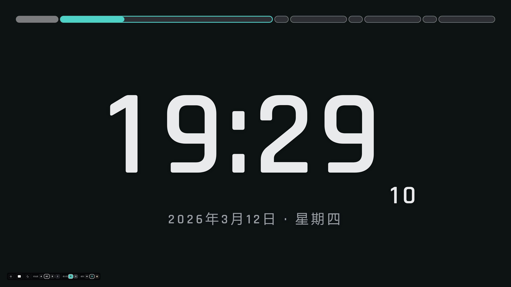
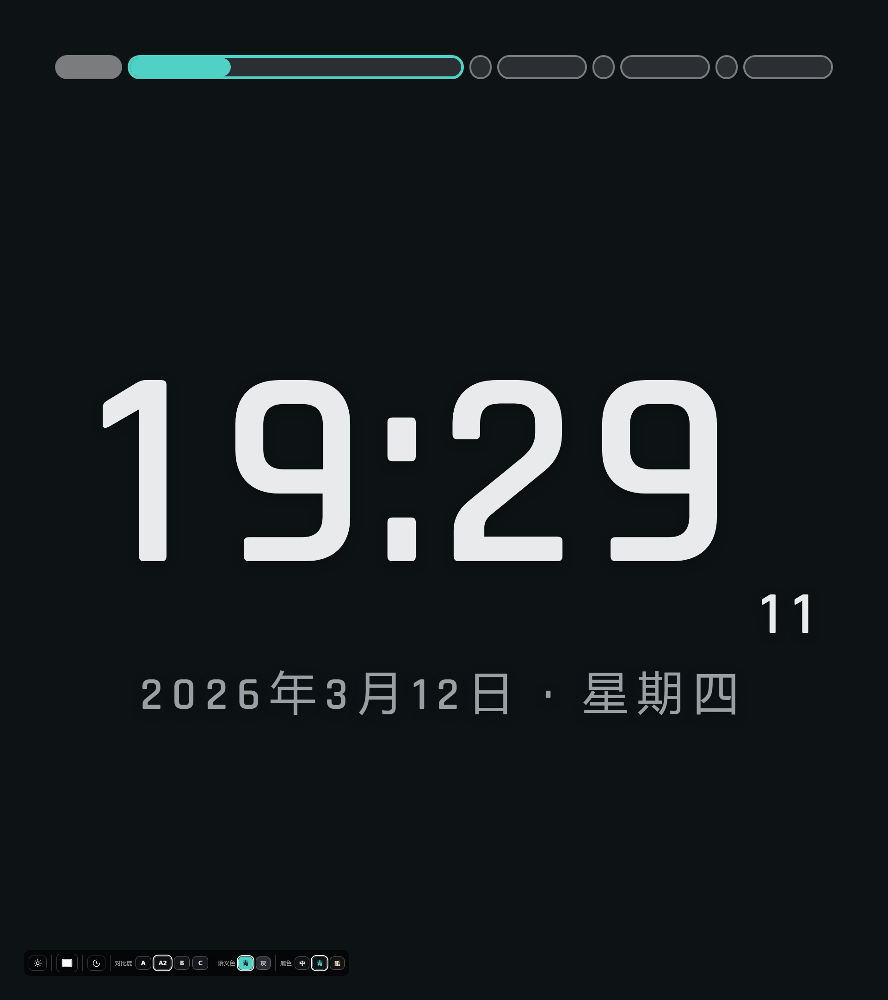

# BigClock · 教室晚自习大屏时钟

给 **3840×2160 教室大屏**用的晚自习时间展示工具。目标只有一个：让学生从教室任何位置一眼看清
**现在几点、现在是什么时段、还剩多久**。

- 顶部分段胶囊进度条按你的作息表驱动，每段宽度 ∝ 真实时长，**当前段横向拉长 + 青色高亮**
- 逐位定宽时钟：换分钟时整块**零位移、零抖动**；字号按容器宽自适应（整屏 / 半屏都不会溢出）
- 暗色（晚自习）+ 亮色（白天开灯）双主题，4 档对比度可选
- **支持整屏 / 左半屏 / 右半屏** —— 大屏常有一半边被黑板挡住
- 配置就是 exe 旁边一个**纯文本文件**，可以直接拿记事本改，存盘 1 秒内生效，不用重启
- 也可以在程序里按 `F1` 打开设置界面改作息表，改完写回同一个文本文件

<br>

**整屏（3840×2160）**



**左半屏（1920×2160 竖屏视口）** —— 另一半被黑板挡住时用



---

## ⚠️ 当前状态（务必先读）

| 部分 | 状态 |
|---|---|
| **前端**（显示、进度条、字号自适应、主题、设置界面） | ✅ 已完成，**65 项自动化检查全通过**（真实 Chromium + Tauri 后端模拟，覆盖配置加载→渲染→改作息表→保存写回整条链路） |
| **Rust 后端**（配置读写/热重载、Win32 窗口控制、快捷键、单实例） | ⚠️ **代码已写完，但尚未通过编译器验证** |
| **打包 / 发布** | ⏳ 未开始 |

也就是说：**界面部分可以直接在浏览器里跑起来看**（见下方「只看界面」），
但**还没有编译出可用的 exe**。Rust 部分首次编译大概率还需要修几个类型/API 错误。

---

## 快速开始

### 只看界面（不需要 Rust，立刻能跑）

```powershell
npm install
npm run dev          # 浏览器打开 http://localhost:5183
```

没有 Tauri 后端时，前端会自动回退到默认配置（单段 `18:40–19:00`），
界面、字号自适应、进度条都可以正常看和调。设置面板也能开，只是保存会提示拿不到配置。

### 构建桌面应用（需要 Rust 工具链）

前置条件：

| 依赖 | 说明 |
|---|---|
| Node ≥ 18 | 构建前端 |
| Rust ≥ 1.77 + MSVC 工具链 | `rustup` 装 `stable-x86_64-pc-windows-msvc`，另需 VS2022 生成工具（提供 `link.exe`） |
| WebView2 Runtime | Windows 11 自带；Windows 10 可能需装一次（微软官网免费） |
| Tauri CLI | `cargo install tauri-cli --locked --version "^2"` |

```powershell
npm install
npm run build                 # 先出前端产物到 dist/
cd src-tauri
cargo build --release         # 首次要拉 ~400 个 crate，10 分钟以上
```

产物：`src-tauri\target\release\bigclock.exe`

---

## 配置

首次启动时，程序会在 **exe 同目录**生成 `bigclock.toml`。它就是个普通文本文件，
用记事本改完存盘，界面 1 秒内自动更新。

参考 [`bigclock.example.toml`](bigclock.example.toml)。

```toml
theme        = "dark"        # dark（晚自习）/ light（白天开灯）
mode         = "fullscreen"  # fullscreen（全屏展示）/ window（窗口配置）
half         = "full"        # full（整屏）/ left（左半屏）/ right（右半屏）
screen       = 0             # 第几块显示器，0 = 主屏
contrast     = "A2"          # A | A2 | B | C —— 只对暗色有效，越往后越柔
tint         = "cyan"        # neutral | cyan | warm（背景色偏）
clock_format = "hm"          # hm（19:29）/ hms（19:29:53）
title        = ""            # 顶部标题，留空则不显示

[bar]
enabled     = true           # 是否显示进度条
show_names  = false          # 是否在当前段里显示段名
gap_minutes = true           # 时段之间的空档是否自动补成「课间」

[[periods]]
name  = "晚自习"
start = "18:40"
end   = "19:00"
```

### 时间写法很宽松

`18:40` / `1840` / 全角 `18：40` 都认；`end` 允许写 `24:00`；
**跨零点也支持**：`start = "23:30", end = "00:10"`。

### 进度条规则

每段宽度 ∝ 该段真实时长 → **当前段拉长到原长的 250%**，但**上限为总宽的 70%**，
其余段按比例让位，整条精确占满 100%。

### 健壮性

配置文件写坏（乱码 / 删字段 / 值写错）时，程序**保留上一次有效配置**继续显示，
只在左下角提示错误 —— 绝不让大屏白屏。

---

## 快捷键

| 键 | 作用 |
|---|---|
| `F1` | 打开 / 关闭设置 |
| `F11` | 全屏 ⇄ 窗口 |
| `←` / `→` | 左半屏 / 右半屏 |
| `↓` | 整屏 |
| `Esc` | 退出全屏（设置开着时是关闭设置） |
| `T` | 暗色 ⇄ 亮色 |

鼠标 3 秒不动会自动隐藏光标；设置面板打开时不隐藏。

---

## 目录结构

```
BigClock/
├─ index.html              前端入口
├─ src/
│  ├─ main.ts              启动、定时器、事件绑定、设置面板
│  ├─ time.ts              整分对齐时钟
│  ├─ segments.ts          分段计算：宽度分配、三态、拉长规则
│  ├─ render.ts            逐位定宽数字渲染 + 局部 DOM 更新
│  ├─ fit.ts               时钟字号自适应
│  ├─ config.ts            配置类型 + 宽松时间解析 + 兜底校验
│  ├─ styles.css           全部样式（含配色令牌）
│  └─ fonts/               内嵌字体
├─ src-tauri/
│  ├─ src/main.rs          启动、状态、热重载装配
│  ├─ src/config.rs        配置读写 + 宽松解析 + 校验 + notify 监听
│  ├─ src/display.rs       Win32 显示器枚举 + 整屏/半屏定位
│  ├─ src/commands.rs      前端可调指令
│  ├─ src/cursor.rs        光标自动隐藏
│  └─ tauri.conf.json
├─ design-preview.html     最早的设计稿（静态 HTML，保留作参考，不参与打包）
├─ BUG-交接文档.md          字号不重算那个 bug 的完整根因记录
├─ 实施计划.md              整体方案与验收标准
└─ .preview/               开发期自动化验收脚本（浏览器驱动，不进仓库）
```

---

## 开发笔记：一个值得记下来的坑

时钟字号在「全屏 ⇄ 半屏」切换后不重算，永远停在 CSS 兜底值 —— 零报错、零控制台输出。
真凶是**一个 NaN**：

```js
parseFloat(getComputedStyle(root).getPropertyValue('--pad-x')) * 2
```

`getComputedStyle` 读**自定义属性**返回的是 **token 流原文**（实测拿到字符串
`"min(5.5vmin, 4.6vw)"`，连 `"2.4vmin"` 都是原样返回），**不是解析后的像素**。
于是 `parseFloat(...)` = `NaN` → `avail = NaN` → `if (!(avail > 0)) return;` **静默返回**。

由此确立三条硬规则（`src/fit.ts` 里也写了）：

1. **绝不用 `getComputedStyle` 读自定义属性再 `parseFloat`** —— 要读就读具体属性
   （`paddingLeft`、`fontSize` 这些返回真实像素）
2. **不要用 em 常量硬算宽度** —— 靠"数格子"推字距个数一定会错
3. **量自然宽度前必须解除约束** —— `max-width:100%` 会把读数夹到容器宽，
   `transform` 会让读数落在位移后的坐标系里

完整记录见 [`BUG-交接文档.md`](BUG-交接文档.md)。

---

## 许可

MIT
